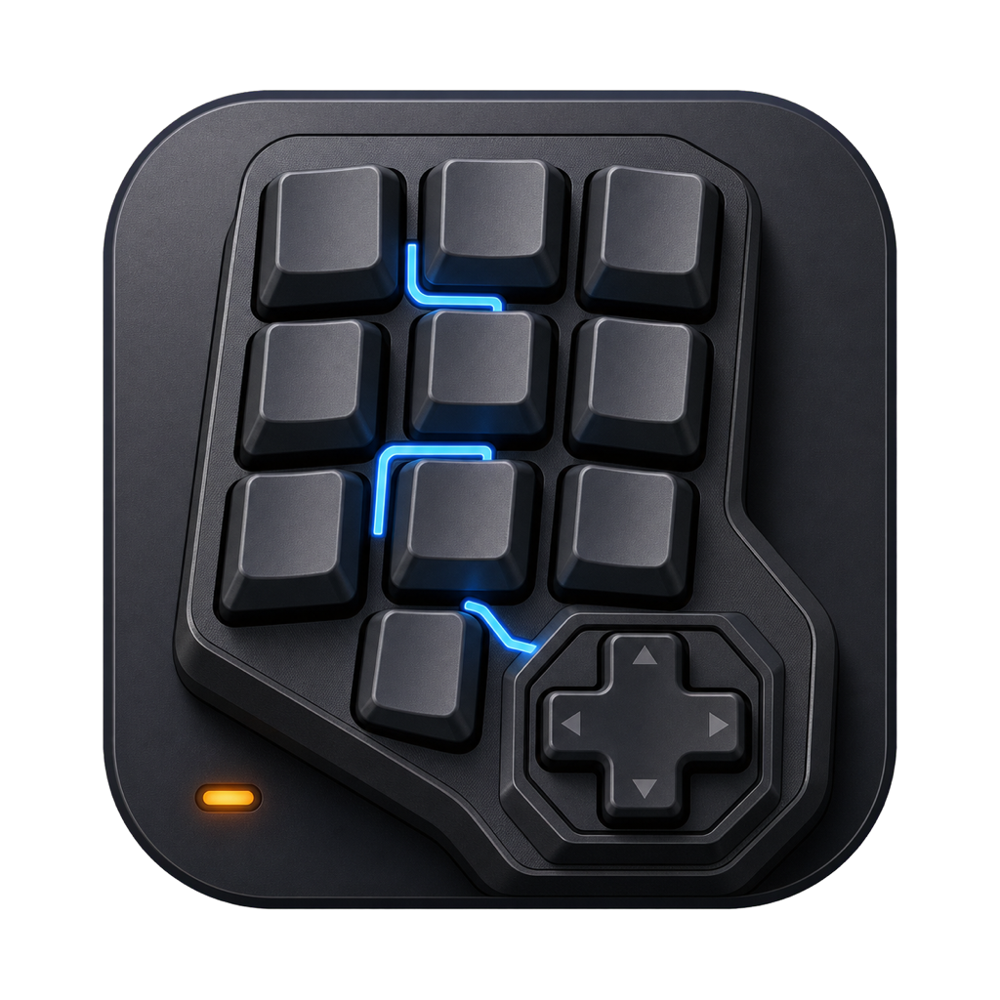
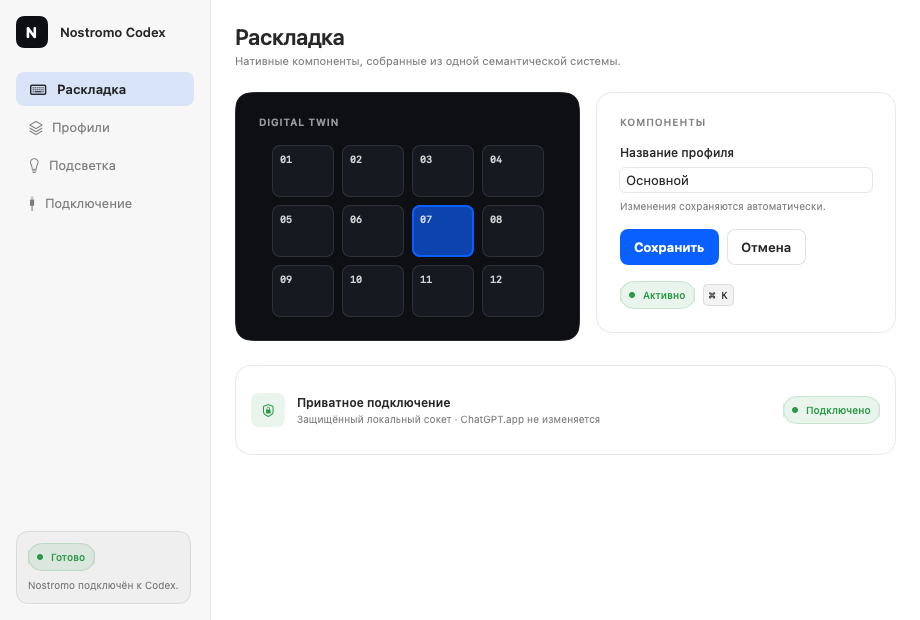

<div align="center">
  

  # Nostromo Codex

  Нативная macOS-панель действий Codex для Razer Nostromo — без Karabiner.

  [](https://github.com/ksandrpetrov/nostromo-for-codex/actions/workflows/ci.yml)
  [](Package.swift)
  [](Package.swift)
  [](LICENSE)
</div>

> [!IMPORTANT]
> Проект находится на экспериментальной стадии и собирается из исходников.
> Публичного подписанного и notarized-бинарного дистрибутива пока нет. CI
> проверяет сборку и автоматические regressions текущей ветки, но физическая
> приёмка на нескольких экземплярах Nostromo и полный live E2E с ChatGPT
> остаются ручными проверками.

<picture>
  <source media="(prefers-color-scheme: dark)" srcset="docs/assets/design-system-dark.png">
  <source media="(prefers-color-scheme: light)" srcset="docs/assets/design-system-light.png">
  
</picture>

<p align="center"><sub>Безопасно сгенерированный SwiftUI snapshot дизайн-системы — приложение, HID и ChatGPT при его создании не запускаются.</sub></p>

## Зачем это нужно

Nostromo Codex превращает Razer Nostromo RZ07-0049 в отдельный макропад для
ChatGPT Codex. Клавиши, D-pad и колесо можно назначить на команды Codex,
видимые task slots, skills, подготовку plugin prompt, сочетания macOS и
переключение профилей.

Приложение живёт в menu bar, напрямую читает устройство через
`IOHIDManager`, а ChatGPT получает события как от локально эмулированного
контроллера Codex Micro. Системная клавиатурная раскладка не требуется.
Интеграция использует проверенные внутренние интерфейсы конкретной desktop-
сборки ChatGPT, а не официальный стабильный API; поэтому build gate является
обязательной частью безопасности.

## Возможности

- 16 клавиш, восемь направлений D-pad и жесты колеса.
- Команды Codex, task slots, skills, plugin prompts и сочетания macOS.
- Постоянные и моментальные профили с импортом, экспортом и восстановимой
  резервной копией.
- Push-to-talk: удержание для записи и двойное нажатие для фиксации.
- Интерактивный digital twin и безопасный Input Test, который не выполняет
  назначения.
- Поиск по библиотеке действий и recorder сочетаний клавиш.
- Общая подсветка клавиш и три status LED для состояния Codex.
- Приватный локальный bridge с одноразовым 256-битным токеном.
- Fail-closed защита: действия блокируются, пока ввод Nostromo не изолирован
  от обычной печати.

## Требования

| Компонент | Требование |
|---|---|
| Mac | Apple Silicon |
| macOS | 26.0 или новее |
| Xcode | 26 или новее, Swift 6.3 / SwiftPM 6.3 |
| Устройство | Razer Nostromo RZ07-0049, USB `1532:0111` |
| ChatGPT | Установлен в `/Applications/ChatGPT.app` |
| Совместимые сборки | `26.721.41059 (5848)`, `26.721.81911 (5973)` |
| Node.js | Только для preload-тестов |

Неизвестные сборки ChatGPT блокируются по умолчанию. Expert override не
обходит отсутствие обязательных внутренних модулей и не означает
совместимость.

Ограничение относится к приватному мосту. При его недоступности Nostromo
сохраняет базовые команды через системное меню macOS: новую задачу,
предыдущую/следующую задачу, боковую панель и настройки. Перед действием
Codex выводится вперёд. Нужен Accessibility; поддерживаются точные названия
команд на русском и английском. Неизвестные или неоднозначные пункты
блокируются. PTT, статусы задач, отправка и подтверждения требуют полного
подключения. Профили не переписываются при переключении режима.

Для `26.903.61454 (8378)` подготовлен кандидат адаптера. Live-проверка ещё
не выполнена, поэтому эта сборка пока автоматически использует базовый режим.
Текущий статус без запуска приложения или HID показывает:

```sh
node scripts/inspect-codex.cjs
```

Порядок проверки обновлений: [совместимость Codex](docs/codex-compatibility.md).

Проверьте установленную версию до запуска:

```sh
defaults read /Applications/ChatGPT.app/Contents/Info CFBundleShortVersionString
defaults read /Applications/ChatGPT.app/Contents/Info CFBundleVersion
```

Поддерживаются пары `26.721.41059` / `5848` и `26.721.81911` / `5973`.
Для других сборок приватный мост не запускается автоматически; используйте
базовый режим до проверки адаптера.

После клонирования репозитория можно пассивно сверить устройство:

```sh
./scripts/hardware-test.sh --inventory
```

Команда должна найти Razer Nostromo с USB ID `1532:0111`; она только читает
IORegistry и не открывает HID.

## Быстрый старт

Для первого скачивания:

```sh
git clone https://github.com/ksandrpetrov/nostromo-for-codex.git
cd nostromo-for-codex
./scripts/build-app.sh release
```

Если копия проекта уже существует, выполните в её папке:

```sh
git pull --ff-only
./scripts/build-app.sh release
```

Клонирование требуется только при первом скачивании. Если Git сообщает
`destination path ... already exists`, откройте существующую папку проекта
и используйте команды обновления выше.

Сборка обновляет приложение в `dist`. Если вы запускаете копию из
`/Applications`, завершите Nostromo Codex и замените её новой сборкой из
`dist`. Без этого установленное приложение останется старым. Новая версия
допускает только один работающий экземпляр, чтобы две копии не меняли
раскладку Nostromo и файл восстановления одновременно.

Превью каталога интерфейса используют
[`PreviewProvider`](https://developer.apple.com/documentation/swiftui/previewprovider/)
только в debug-сборках. Сборка из терминала не требует плагина
`PreviewsMacros` для этих превью.

Сборка не запускает приложение и не открывает устройство. Следующая команда
откроет Nostromo Codex; после завершения setup приложение сможет захватить
HID и запустить либо подключить ChatGPT.

```sh
open "dist/Nostromo Codex.app"
```

Первый build создаёт отдельную локальную code-signing identity в
`~/Library/Application Support/Nostromo Codex/Signing`. Она используется
повторно, чтобы macOS воспринимала последующие сборки как обновления одного
приложения. Это локальная подпись: она не заменяет Developer ID и
notarization.

### Первый запуск

1. Подключите Nostromo и завершите guided setup. До его явного завершения
   приложение не захватывает HID и не запускает ChatGPT.
2. Разрешите **Input Monitoring**:
   `System Settings → Privacy & Security → Input Monitoring`.
   macOS выдаёт приложению широкое системное разрешение наблюдать ввод;
   Nostromo Codex использует его для событий целевого устройства.
3. Если нужны обычные macOS shortcuts, также разрешите **Accessibility**:
   это системное разрешение шире одной функции управления UI, но проект
   использует его для отправки только настроенных вами сочетаний клавиш.
4. Если ChatGPT уже запущен, сохраните незавершённый текст и используйте
   **Restart ChatGPT…** в разделе Connection.

Конфигурация хранится в:

```text
~/Library/Application Support/Nostromo Codex/profiles.json
```

Импорт сначала показывает summary и создаёт резервную копию текущей
конфигурации.

## Как устроена интеграция

```text
Razer Nostromo
  → IOHIDManager
  → Nostromo Codex
  → authenticated Unix socket
  → preload дочернего процесса ChatGPT
  → проверенные команды установленной сборки
```

Nostromo Codex не изменяет и не переподписывает
`/Applications/ChatGPT.app`. Preload передаётся только запущенному
приложением дочернему процессу через `NODE_OPTIONS`. Socket и owner marker
создаются с ограниченными правами, а доступные команды сверяются с runtime
capability manifest.

Подробные владельцы состояния и инварианты описаны в
[`ARCHITECTURE.md`](ARCHITECTURE.md).

## Ограничения

- Поддерживается только конкретная модель Nostromo и Apple Silicon.
- Адаптер жёстко ограничен проверенной сборкой ChatGPT; после обновления
  ChatGPT может потребоваться изменение и повторная проверка adapter-а.
- Готового бинарного релиза, Developer ID signing и notarization пока нет.
- Автоматические тесты не доказывают физическую работу клавиш, D-pad, колеса,
  PTT и LEDs на конкретном экземпляре устройства.
- Plugin binding подготавливает composer, но не отправляет сообщение.

## Разработка и проверка

Короткий безопасный цикл:

```sh
swift test --skip NostromoCodexAppTests.LiveChatGPTE2ETests
node --check Sources/NostromoCodexApp/Resources/chatgpt-preload.cjs
node Tests/preload-unit.cjs
node Tests/preload-smoke.cjs
node Tests/docs-links.cjs
```

Полная автоматизированная проверка:

```sh
./scripts/deep-test.sh --full --hardware-inventory
```

Runner проверяет debug/release, warnings-as-errors, ASan, TSan, preload,
упаковку `.app`, подпись, архитектуру и minimum macOS. Он не открывает
Nostromo Codex, не захватывает HID, не управляет LEDs и не
запускает/останавливает ChatGPT.

Ручные режимы намеренно отделены:

```sh
./scripts/hardware-test.sh --inventory
./scripts/hardware-test.sh --checklist
./scripts/hardware-test.sh --launch-hid-only
```

`--inventory` пассивно читает IORegistry, а `--checklist` только печатает
инструкцию. `--launch-hid-only` открывает устройство и может эксклюзивно
захватить его, поэтому запускайте этот режим только осознанно.

## Удаление

1. Полностью завершите Nostromo Codex, чтобы освободить HID и восстановить
   временную защиту клавиатурных usages.
2. Удалите собранный `dist/Nostromo Codex.app`.
3. Если конфигурация и локальная signing identity больше не нужны, переместите
   в Корзину `~/Library/Application Support/Nostromo Codex`.
4. При необходимости удалите Nostromo Codex из списков Input Monitoring и
   Accessibility в System Settings.
5. Завершите ChatGPT, который был запущен через Nostromo Codex, и запустите
   `/Applications/ChatGPT.app` обычным способом. Так новый процесс стартует
   без preload из прежней интеграции.

## Документация

- [Карта документации](docs/README.md)
- [Архитектура и критические инварианты](ARCHITECTURE.md)
- [Руководство по тестированию](docs/testing.md)
- [Физическая приёмка](docs/hardware-acceptance.md)
- [UI/UX-исследование](docs/design/ux-research.md)
- [Исторические аудиты](docs/audits/2026-07-26/)
- [Third-party notices](THIRD_PARTY_NOTICES.md)

## Участие в разработке

Перед изменениями прочитайте [`CONTRIBUTING.md`](CONTRIBUTING.md) и
[`ARCHITECTURE.md`](ARCHITECTURE.md). Ошибки лучше оформлять через GitHub
Issues с версиями macOS, ChatGPT и точной моделью устройства. Уязвимости
следует сообщать по инструкции в [`SECURITY.md`](SECURITY.md), не публикуя
чувствительные детали в обычном issue.

## Лицензия

Исходный код распространяется по лицензии [MIT](LICENSE). Заимствования и
исследованные сторонние реализации перечислены в
[`THIRD_PARTY_NOTICES.md`](THIRD_PARTY_NOTICES.md).
